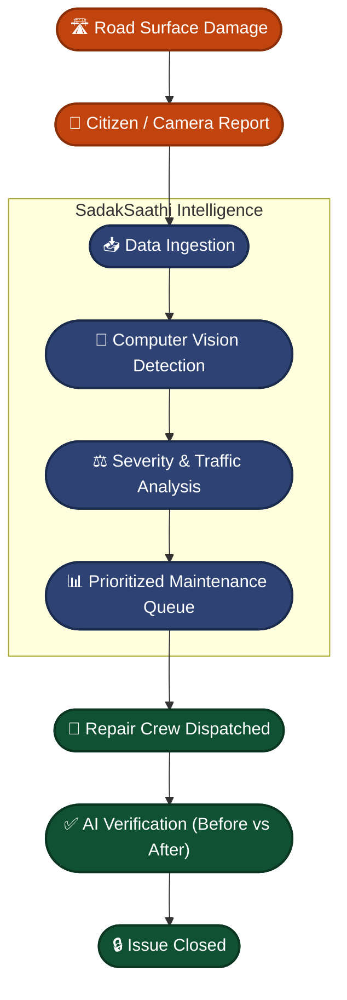

<div align="center">

# SadakSaathi 🛣️
### Every Pothole Detected Before It Costs a Life.

**An AI-powered system for detecting, prioritizing, and verifying road repairs — turning scattered complaints into a live, data-driven maintenance system for cities.**

<br>


</div>

<br>

<div align="center">
<table>
<tr>
<td align="center" width="25%">📸<br><b>Capture</b><br><sub>Crowdsourced & Auto-feed</sub></td>
<td align="center" width="25%">🧠<br><b>Detect</b><br><sub>On-device Computer Vision</sub></td>
<td align="center" width="25%">🚦<br><b>Prioritize</b><br><sub>Smart Severity Scoring</sub></td>
<td align="center" width="25%">✅<br><b>Verify</b><br><sub>Before-and-After Comparison</sub></td>
</tr>
</table>
</div>

---

## Table of Contents

- [Problem at a Glance](#problem-at-a-glance)
- [SadakSaathi at a Glance](#sadaksaathi-at-a-glance)
- [Why This Matters](#why-this-matters)
- [System Architecture](#system-architecture)
- [UI/UX Highlights](#uiux-highlights)
- [Getting Started](#getting-started)
- [Deployment](#deployment)

---

## Problem at a Glance

Cities are plagued by delayed road maintenance. Citizens report potholes, but the complaints are scattered across multiple platforms (Twitter, local apps, calls). The municipality lacks a centralized, intelligent way to filter out duplicates, assess the actual severity of the damage, and prioritize repairs based on safety and traffic impact. 

By the time a critical pothole is repaired, it may have already caused vehicle damage or fatal accidents.



SadakSaathi intervenes precisely at the ingestion phase: it uses a computer vision model trained on thousands of real road-damage images to automatically scan incoming reports, measure the severity (width, depth), and score the urgency based on location data.

---

## SadakSaathi at a Glance

| Feature | Description |
|---|---|
| **Core AI Model** | Computer vision inference for pothole/crack detection |
| **Ingestion** | Agnostic intake from cameras, app, and social feeds |
| **Prioritization Engine** | Ranks by damage severity, traffic density, and proximity to critical infrastructure |
| **Verification** | Automated before-and-after image matching |
| **Frontend Platform** | Next.js 15 App Router |
| **Styling & Motion** | Tailwind CSS + Lenis Smooth Scrolling |

---

## Why This Matters

Every year, unmaintained roads cause thousands of accidents and significant vehicle damage. 
- **Reactive vs Proactive**: Cities typically fix what is reported the loudest, rather than what is most critical.
- **Resource Optimization**: Municipalities have limited repair crews; SadakSaathi ensures they are deployed where they can prevent the most harm.
- **Closed Loop**: Automated verification means contractors are held accountable without requiring a municipal inspector to physically visit every site.

---

## UI/UX Highlights

The SadakSaathi landing page is built to convey trust, modernity, and seamless functionality:
- **Dynamic Smooth Scrolling**: Integrated with `lenis` for an effortless native-feel scroll experience across all devices.
- **Active Navigation Tracking**: The interactive sticky navbar tracks your scroll position and smoothly glides to anchor points, dynamically updating its visual state.
- **Glassmorphism Footer & Components**: Utilizing advanced CSS masking, SVG blending, and backdrop-blur effects for a premium frosted-glass aesthetic.
- **Responsive Layout**: Flawlessly adapts from mobile to widescreen monitors, maintaining typographic hierarchy and visual balance.

---

## Getting Started

First, install the dependencies:

```bash
npm install
```

Then, run the development server:

```bash
npm run dev
```

Open [http://localhost:3000](http://localhost:3000) with your browser to see the application in action.

## Deployment

The easiest way to deploy this Next.js app is to use the [Vercel Platform](https://vercel.com/new).

## License

This project is open-source and available under the [MIT License](LICENSE).
